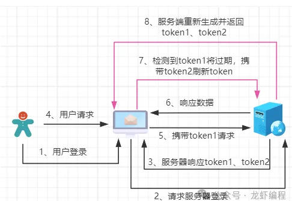
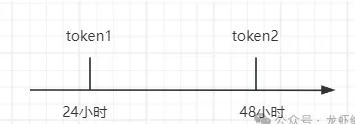
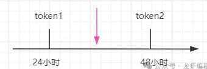
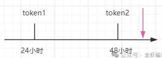

# Refresh Token

当用户在登录成功之后，服务端生成并返回两个 token 给客户端，其中 token 1 是用户执行业务请求访问服务器的时候使用，假设设置过期时间为 24 小时； token 2 是用于给的 token 1和 token 2 续期的时候使用，假设设置过期时间为 48 小时，如下图示所示：



当 token 1 过期之后开始启用 token 2，客户端携带 token 2请求服务器刷新 token ，服务器针对 token 2有如下的执行逻辑：



（1）如果服务端验证 token 2 没有过期，那认定用户还是活跃用户，如下图所示时间点：



此时服务端正常的生成并返回两个新的 token （ token 1 和 token 2，并且设置对应的过期时间），此时用户还可以请求服务器执行业务逻辑。

（2）如果 token 2刷新的时候，服务端发现 token 2 也过期了，如下图所示的时间点：



这个时候，我们就需要强制要求用户重新的登录系统，服务器再颁发两个新的 token 给客户端。

通过双 token 的验证方式是可以有效地区分用户是活跃用户还是非活跃用户，给活跃的用户可以自动的续期，对于非活动的用户需要再次执行登录操作。

# 具体实现

如何检测 Token 快要过期呢？如果前端拿到的 token 的话，可以设置一个定时器检测 Token 快要过期。不过笔者认为这不是一个好的方式。而且最重要的是，Token 仍在 HttpOnly Cookie 中，前端无法获取（当然你可以安排一个接口获取之，或者登录时候返回过期时间，总有办法的，但都不是好的方式）。

## 前端刷新
既然前端不能获取 Token 或者超时时间，那么换种思路，就是全局监听 401 Unauthorized 错误，然后立即尝试刷新 token（当然要保存前面请求在上下文中）。获取成功后在发送原来的业务请求。

这要求：

- 前端请求组件的配合，拦截 401 HTTP Code
- 全局的拦截
- 可以恢复前面的业务请求

例如 Axios 拦截器的：

```javascript
let isRefreshing = false;
let failedQueue = []; // 存储等待刷新后重发的请求

const processQueue = (error, token = null) => {
  failedQueue.forEach(prom => {
    if (error) {
      prom.reject(error);
    } else {
      prom.resolve(token);
    }
  });
  failedQueue = [];
};

axios.interceptors.response.use(
  response => response,
  async error => {
    const originalRequest = error.config;

    // 如果不是 401，或者已经重试过，直接抛出
    if (error.response?.status !== 401 || originalRequest._retry) {
      return Promise.reject(error);
    }

    // 防止多个请求同时触发多次刷新
    if (isRefreshing) {
      // 暂存请求，等待新 token
      return new Promise((resolve, reject) => {
        failedQueue.push({ resolve, reject });
      }).then(token => {
        originalRequest.headers['Authorization'] = 'Bearer ' + token;
        return axios(originalRequest);
      }).catch(err => {
        return Promise.reject(err);
      });
    }

    originalRequest._retry = true;
    isRefreshing = true;

    try {
      // 发起刷新请求（后端会通过 Cookie 中的 Refresh Token 创建新 Access Token）
      const { data } = await axios.post('/api/refresh');

      // 刷新成功：新的 Access Token 已通过 Set-Cookie 下发
      // 此时浏览器已自动更新 Cookie，无需前端设置

      processQueue(null, data.access_token); // 可选：如果后端也返回 token
      return axios(originalRequest); // 重发原请求

    } catch (refreshError) {
      // 刷新失败：可能是 Refresh Token 也过期了
      processQueue(refreshError, null);
      // 跳转登录页或清除状态
      window.location.href = '/login';
      return Promise.reject(refreshError);
    } finally {
      isRefreshing = false;
    }
  }
);
```

## 后端刷新
前面介绍的是前端刷新机制，后端也可以做到，那样就不必修改前端了。

## 小结
无论前端方案还是后端方案，都要求生成 JWT 时候一起生成 Refresh Token。传递 Token 的时候也要把 Refresh Token 一并传过来，包括通过 HTTP Head/QueryString 传递 Token，否则如果由于没有 Refresh Token，所以刷新 Token 失败，就会跳转到登录页。