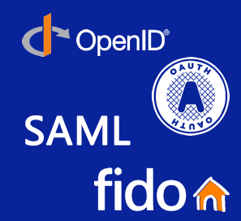
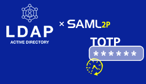

# AJ-IAM 简介

统一身份认证（Identity and Access Management，简称 IAM）是为用户管理及权限管理而提供的基础服务，可以帮助您安全地控制用户和资源的访问权限。 

系统全面支持 OIDC（OpenID Connect）、OAuth2.0（Open Authorization 2.0）、JWT（Json Web Token）、SAML（Security Assertion Markup Language）等协议。如果您使用各种应用程序或者服务，例如管理后台、CMS 发布系统等，您可以使用 IAM 的用户管理功能，给员工或应用程序统一创建 IAM 用户，并授予 IAM 用户刚好能完成工作所需的权限，新创建的 IAM 用户可以使用自己单独的用户名和密码登录服务。IAM 用户的作用是多用户协同操作同一帐号时，避免分享帐号的密码（SSO（Single Sign On/单点登录）。 

## 相关概念

单点登录（SSO）有哪些常见协议？常见协议有：CAS、OAuth 2.0、OIDC、SAML。中央授权中心以 OIDC 协议为主推方向，并支持 SAML、OAuth 2.0 协议。CAS 与其他协议相比并无优势，IAM 不支持。

OIDC 中怎样获取 Token？有哪些方式？通过令牌端点（Token Endpoint）获得 Token，您可以通过发现文档找到这个端点的地址。获取 Token 的方式可分为：有用户参与和无用户参与两类。有用户参与的方式包括`authorization_code`、`password`（不对外开放）、`implicit`（出于安全考虑不开放）。这些模式的接口除了返回 AccessToken 之外，还可以获取用户的 IDToken，同时提供 Token 刷新机制。无用户参与的方式主要是`client_credentials`模式。

> 中央授权中心为什么不支持 CAS？ CAS（Central Authentication Service）在 4.x 版本之前主要是一个较为简单的单点登录（SSO）协议。随着时间推移和安全需求的提升，4.x 之前的 CAS 版本显得相对陈旧，在安全性、扩展性和现代应用场景支持方面存在不足。
> 
> 为了适应现代安全标准和更广泛的技术生态，CAS 从 5.x 版本开始进行了重大升级，逐步引入对现代开放标准协议的支持，例如 SAML 2.0、OAuth 2.0 和 OpenID Connect（OIDC）。这一演进方向表明，CAS 社区本身也在向主流标准靠拢。
> 然而，尽管 CAS 5.x 及以后版本增加了对这些现代协议的支持，它仍然保留了原有的基于票据（Ticket）的认证机制。这种双重架构带来了许多的问题。

- 什么是 FIDO？FIDO（Fast Identity Online，线上快速身份验证联盟）是一个联盟。可以通过支持 FIDO2 协议的硬件或软件设备实现安全且快速的身份验证。
- LDAP（Lightweight Directory Access Protocol，轻量目录访问协议）是一种用于访问和管理分布式目录服务的开放协议。授权中心的 SAML 服务可以通过 LDAP 协议查询各单位的 AD（Active Directory）用户资料，实现权限管控。
- TOTP（Time-Based One-Time Password，基于时间的一次性密码）是一种基于时间的一次性密码算法，用于增强身份验证的安全性